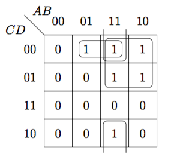
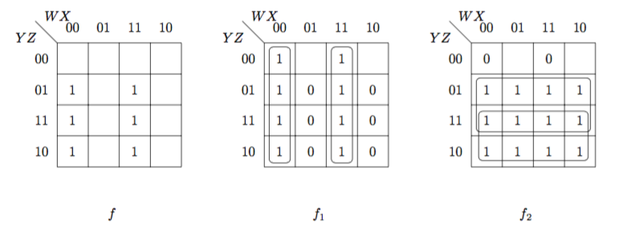
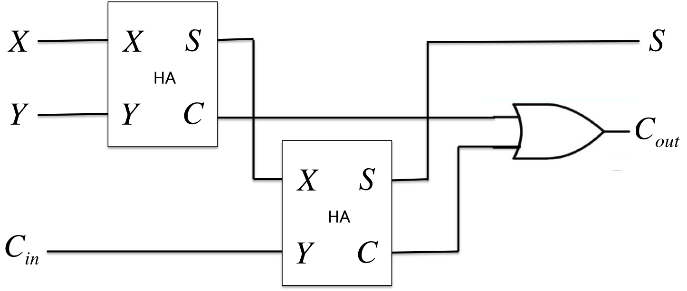
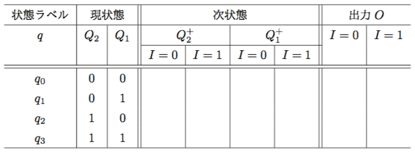
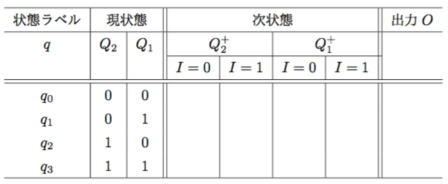
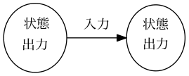
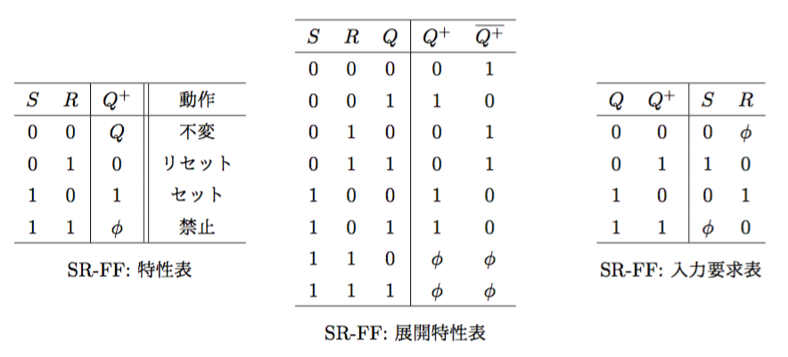
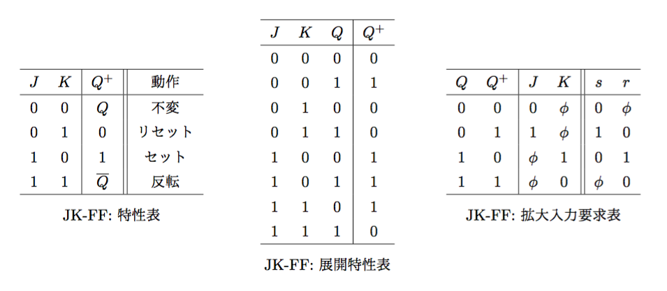

\\(
\def\Bset{\mathcal{B}}
\def\bvec#1{\mathbf{#1}}
\\)

# 論理回路(Logic Circuit)

## 論理代数（Logical Algebra）

- `ブール領域(Boolean domain)`:　\\(\Bset = \{0, 1\}\\)
- `否定(NOT/negation/inversion)`:　\\(\overline{X},\; \lnot X\\)
- `論理積/合接/連言(AND/conjunction)`:　\\(X \cdot Y,\; X \land Y\\)
- `論理積/離接/選言(OR/disjunction)`:　\\(X + Y,\; X \lor Y\\)
- `排他的論理和(XOR/EOR/EX-OR/exclusive or[disjunction])`:　\\(X \oplus Y\\)
	- \\(X\oplus Y = \overline{X}\cdot Y + X\cdot \overline{Y} = (X + Y)(\overline{X} + \overline{Y})\\)　
	- ＊２変数値が同じなら0, 異なるなら1。\\(X \neq Y\\)
- `否定論理和(NAND)`:　\\(X \mid Y,\; \overline{X \cdot Y},\; \lnot (X \land Y) \\) 　＊\\(\mid\\): Sheffer-Stroke
- `否定論理和(NOR)`:　\\(X \downarrow Y,\; \overline{X + Y},\; \lnot (X \lor Y) \\) 　＊\\(\downarrow\\): Pierce-Arrow

\\(X\\) || \\(\overline{X}\\)
--- | --- | ---
0 | | 1
1 | | 0

\\(X\\) | \\(Y\\) || \\(X \cdot Y\\) | \\(X + Y\\) | \\(X \oplus Y\\) 
--- | --- | --- | --- | --- | ---
0 | 0 || 0 | 0 | 0
0 | 1 || 0 | 1 | 1
1 | 0 || 0 | 1 | 1
1 | 1 || 1 | 1 | 0

### 諸定理

- `双対(dual)`:　ある論理式\\(L\\)において、ANDとOR, 0と1をを入れ替えてできる論理式。論理式\\(L\\)が成立している時、それと双対な論理式 \\(L^{d}\\)も成立することを双対性(duality)があると言う。
	- \\(P=Q \Rightarrow P^{d}=Q^{d}\\)

＊\\(\ast\\)はAND または OR演算子とする

- `２重否定(double negative elimination)`: \\(\overline{\overline{X}} = X\\)
- `交換則(commutative law)`:　\\(X \ast Y = Y \ast X\\)
- `結合則(associative law)`:　\\[\begin{cases}(X \ast Y) \ast Z = X \ast (Y \ast Z) \\ (X\oplus Y)\oplus Z = X\oplus (Y\oplus Z)\end{cases}\\]
- `分配則(distribution law)`: \\[\begin{cases}X \cdot (Y + Z) = (X \cdot Y) + (X \cdot Z) \\ X + (Y \cdot Z) = (X + Y) \cdot (X + Z) \\ X \cdot (Y\oplus Z) = (X\cdot Y)\oplus (X\cdot Z)\end{cases}\\]
- `相補則(complement law)`: \\[\begin{cases}X + \overline{X} = 1 \\ X \cdot \overline{X} = 0\end{cases}\\]
- `冪等則(idempotent law)`:　\\(X \ast X \ast \cdots \ast X = X\\)
- `吸収則(absorption law)`:　\\(X = X(Y+\overline{Y})\\)を使って消すと
	\\[ \begin{cases} X + (X \cdot Y) = X \\ X \cdot (X + Y) = X \end{cases} \\]
- `De Morganの法則(De Morgan's laws)`:　\\[ \begin{cases} \overline{X_{1} \cdot X_{2} \cdot \cdots \cdot X_{n}} = \overline{X_{1}} + \overline{X_{2}} + \cdots + \overline{X_{n}} \\ \overline{X_{1} + X_{2} + \cdots + X_{n}} = \overline{X_{1}} \cdot \overline{X_{2}} \cdot \cdots \cdot \overline{X_{n}} \end{cases} \\]

### 論理関数(Logical Function)

\\[L = f(X_{1}, \overline{X_{1}}, X_{2}, \overline{X_{2}}, \cdots , X_{n}, \overline{X_{n}}, \cdot ,+) \\ \overline{L} = f(\overline{X_{1}}, X_{1},  \overline{X_{2}}, X_{2}, \cdots , \overline{X_{n}}, X_{n}, + ,\cdot )\\]

- `双対関数(dual function)`:　論理関数\\(f\\)のすべての変数のNOTをとり、関数全体にNOTをとった論理関数。
\\[ \begin{eqnarray} f^{d}&=&\overline{f(\overline{X_{1}}, X_{1},  \overline{X_{2}}, X_{2}, \cdots , \overline{X_{n}}, X_{n}, \cdot, + )} \\ &=& f(X_{1}, \overline{X_{1}}, X_{2}, \overline{X_{2}}, \cdots , X_{n}, \overline{X_{n}}, +, \cdot) \because \text{De Margan's laws} \end{eqnarray}\\]

- `自己双対関数(self‐dual function)`:　\\(f=f^{d}\\)となる論理関数。

- \\(x_{i}\\)-residue:　\\(f(x_{1}, x_{2}, \cdots ,x_{n})\\)に\\(x_{i}=1\\)を入れたもの。\\(f_{x_{i}}, f_{i}(1)\\)といった表記が使われる。
\\[f_{x_{i}} = f(x_{1}, \cdots, x_{i-1}, 1, x_{i+1}, \cdots, x_{n})\\]

- \\(\overline{x_{i}}\\)-residue:　\\(f(x_{1}, x_{2}, \cdots ,x_{n})\\)に\\(x_{i}=0\\)を入れたもの。\\(f_{\overline{x_{i}}}, f_{i}(0)\\)といった表記が使われる。
\\[f_{\overline{x_{i}}} = f(x_{1}, \cdots, x_{i-1}, 0, x_{i+1}, \cdots, x_{n})\\]

- `ブール微分(Boolean difference[derivative])`: [参考1](http://slideplayer.com/slide/2330166/) [参考2](http://manome-yoichi.sakura.ne.jp/ronri5/node8.html)
	- \\[\frac{\partial f}{\partial x_{i}} = f_{x_{i}} \oplus f_{\overline{x_{i}}}\\]　＊\\(x_{i}\\)の値の変化により\\(f\\)の値が変化する条件
	- \\[\frac{\partial}{\partial x_{j}}\left(\frac{\partial f}{\partial x_{i}}\right) = f_{\overline{x_{i}}\overline{x_{j}}} \oplus f_{x_{i}\overline{x_{j}}} \oplus f_{\overline{x_{i}}x_{j}} \oplus f_{x_{i}x_{j}}\\] ＊微分演算は順序の入れ替え可能。

- `リテラル(literal)`:　論理変数そのもの、あるいは、その変数の否定(NOT)。
	- \\(X\\)のリテラルを\\(\tilde{X}^{l}\\)と表し、\\(\tilde{X}^{1}=X, \tilde{X}^{0} = \overline{X}\\)とする。
- `展開定理(expansion theorem)`:　\\[ \begin{cases} X_{i} \cdot f(X_{1},X_{2}, \cdots ,X_{n}) = X_{i} \cdot f_{X_{i}} \\ X_{i} + f(X_{1}, X_{2}, \cdots ,X_{n}) = X_{i} + f_{\overline{X_{i}}} \end{cases}\\]

- `Shannonの展開定理(Shannon’s expansion theorem)`:　\\[\begin{eqnarray} f(X_{1}, \cdots ,X_{i}, \cdots ,X_{n}) &=& (X_{i} \cdot f_{X_{i}}) + (\overline{X_{i}} \cdot f_{\overline{X_{i}}}) \\ &=& (X_{i} + f_{\overline{X_{i}}}) \cdot (\overline{X_{i}} + f_{X_{i}}) \end{eqnarray}\\]

#### 標準形(Normal[Canonical] Form)

\\(f(X_{1}, X_{2}, \cdots ,X_{n})\\)の各変数についてShannnonの展開定理を適用していくと、\\(2^{n}\\)項の積和形または和積形を得る。

\\[ \begin{eqnarray} f(X_{1}, X_{2}, \cdots , X_{n}) =  \overline{X_{1}} \cdot \overline{X_{2}} \cdot \cdots \cdot \overline{X_{n}} &\cdot& f(0, 0, \cdots , 0) \\ + X_{1} \cdot \overline{X_{2}} \cdot \cdots \cdot \overline{X_{n}} &\cdot& f(1, 0, \cdots , 0) \\ + \overline{X_{1}} \cdot X_{2} \cdot \cdots \cdot \overline{X_{n}} &\cdot& f(0, 1, \cdots , 0) \\  &\vdots& \\ + X_{1} \cdot X_{2} \cdot \cdots \cdot X_{n} &\cdot& f(1, 1, \cdots , 1) \\ = (\overline{X_{1}} + \overline{X_{2}} + \cdots + \overline{X_{n}} &+& f(1, 1, \cdots , 1)) \\ \cdot (X_{1} + \overline{X_{2}} + \cdots + \overline{X_{n}} &+& f(0, 1, \cdots , 1)) \\ \cdot (\overline{X_{1}} + X_{2} + \cdots + \overline{X_{n}} &+& f(1, 0, \cdots , 1)) \\  &\vdots& \\ \cdot (X_{1} + X_{2} + \cdots + X_{n} &+& f(0, 0, \cdots , 0)) \end{eqnarray} \\]

- `最小項/極小項(minterm)`:　\\(\tilde{X_{1}}^{l_{1}} \cdot \tilde{X_{2}}^{l_{2}} \cdot \cdots \cdot \tilde{X_{n}}^{l_{n}}\\)
- `最大項/極大項(maxterm)`:　\\(\tilde{X_{1}}^{\overline{l_{1}}} + \tilde{X_{2}}^{\overline{l_{2}}} + \cdots + \tilde{X_{n}}^{\overline{l_{n}}}\\)

*例)* \\(f(X,Y)\\)の最小項、最大項はそれぞれ４項ある。

\\(\overline{X} \ast \overline{Y}, X \ast \overline{Y}, \overline{X} \ast Y, X \ast Y\\)　＊ANDなら最小項、ORなら最大項

- `(主)加法標準形/選言標準形(DNF: (principal) disjunctive normal[canonical] form)`: 
	- \\(f(l_{1}, l_{2}, \cdots, l_{n})=1\\)となるリテラルの組による最小項\\(\tilde{X_{1}}^{l_{1}} \cdot \tilde{X_{2}}^{l_{2}} \cdot \cdots \cdot \tilde{X_{n}}^{l_{n}}\\)のすべてをORで結んだもの
- `(主)乗法標準形/連言標準形(CNF: (principal) conjunctive normal[canonical] form)`:　
	- \\(f(l_{1}, l_{2}, \cdots, l_{n})=0\\)となるリテラルの組による最大項\\(\left( \tilde{X_{1}}^{\overline{l_{1}}} + \tilde{X_{2}}^{\overline{l_{2}}} + \cdots + \tilde{X_{n}}^{\overline{l_{n}}}\right) \\)のすべてをANDで結んだもの

どのような形式の論理関数も唯一の加法標準形と乗法標準形を持つ。

- `万能論理関数集合(universal function set)`:　その要素である論理関数を組み合わせると、任意の論理関数が表現できる論理関数の集合。次の集合は万能論理関数集合。
	- AND/OR形式:　\\(U_{0} = \{NOT, AND, OR\}\\)
	- (NOT-)AND形式:　\\(U_{1} = \{NOT, AND\} \because \text{De Morgan's laws}\\)
	- (NOT-)AND形式:　\\(U_{2} = \{NOT, OR\} \because \text{De Morgan's laws}\\)
	- NAND形式:　\\(U_{3} = \{NAND\}\\)
		- \\[\begin{cases}\overline{X} &=& \overline{X\cdot X} = X\mid X \\ X\cdot Y &=& \overline{\overline{X \cdot Y}} = \overline{X\mid Y} = (X\mid Y)\mid (X\mid Y) \\ X + Y &=& \overline{\overline{X} \cdot \overline{Y}} = \overline{X}\mid \overline{Y} = (X\mid X)\mid (Y\mid Y)\end{cases} \\]
		- \\[\begin{eqnarray} X \oplus Y &=& X\;\overline{Y} + \overline{X}\;Y + X\;\overline{X} + Y\;\overline{Y} = (X + Y)(\overline{X} + \overline{Y}) \\ &=& (X + Y)(X\mid Y) = X\cdot (X\mid Y) + Y\cdot (X\mid Y) \\ &=& (X\mid (X\mid Y))\mid (Y\mid (X\mid Y))\end{eqnarray}\\]
	- NOR形式:　\\(U_{4} = \{NOR\}\\)
		- \\[\begin{cases}\overline{X} &=& \overline{X + X} = X\downarrow X \\ X\cdot Y &=& \overline{\overline{X} + \overline{Y}} = \overline{X}\downarrow \overline{Y} = (X\downarrow X)\downarrow (Y\downarrow Y) \\ X + Y &=& \overline{\overline{X + Y}} = \overline{X \downarrow Y} = (X\downarrow Y)\downarrow (X\downarrow Y)\end{cases}\\]
- `万能論理関数(universal function)`:　万能論理関数集合の要素である論理関数。

- `包含`:　ある論理積項\\(Q\\)の値を1にする変数値の組み合わせすべてに対して、別の論理積項\\(P\\)が1になるとき、\\(P\\)は\\(Q\\)を包含するという。
- `主項(prime implicant)`:　最小項を\\(t_{i}\\)としたとき、加法標準形は\\(f = t_{1} + t_{2} + \cdots + t_{n}\; (i=1,2,\cdots n)\\)と表せ、\\(t_{i}\\)が\\(t_{j}\; (i\neq j)\\)のいずれにも包含されないととき,\\(t_{i}\\)を主項という。
	- 例) \\(f = X\,\overline{Z} + X\;Y + X\;\overline{Y}\;\overline{Z}\\)のうち、主項は\\(X\,\overline{Z}\\)と\\(X\;Y\\)。\\(X\;\overline{Y}\;\overline{Z}\\)は\\(X\,\overline{Z}\\)に包含されるので主項ではない。
- `最小積和形`:　主項だけで構成され、主項の総数が最小の積和形。
- `必須(主)項(essential prime implicant)`:　加法標準形を構成する最小項を包含する唯一の主項。
- `特異最小項(singular minterm)`:　必須主項に包含される最小項。

### 論理関数の表現

- `Grayコード(Gray code)/交番二進符号(reflected binary code)`:　前後に隣接する符号間のHamming距離(Hamming distance)が1の符号
	- ２進数のGrayコードの作り方：1bit右論理シフトして元の数との排他的論理和をとる

```swift
extension Int { //swift 3.0
    var grayCode: Int { return self^(self>>1) }
    func biaryFormat(bit n: Int) -> String {
        return [Int](0..<n).map { x in (self>>(n-x-1))&1 == 0 ? "0" : "1" }.joined()
    }
}
for n in 1...4 {
    print([Int](0..<(1<<n)).map { x in x.grayCode.biaryFormat(bit: n) })
}
//["0", "1"]
//["00", "01", "11", "10"]
//["000", "001", "011", "010", "110", "111", "101", "100"]
//["0000", "0001", "0011", "0010", "0110", "0111", "0101", "0100", "1100", "1101", "1111", "1110", "1010", "1011", "1001", "1000"]
```

- `ドントケア/不完全定義/組み合わせ禁止(don't care)`:　論理関数の変数値の組みに対して、論理関数値が定義されていないこと

#### n次元立方体(N-Cube)/超立方体(Hypercube)


#### [２分決定図(BDD;Binary Decision Diagram)](https://en.wikipedia.org/wiki/Binary_decision_diagram)

#### Karnaugh図(Karnaugh Map)

真理値の1またはドントケア\\(\phi\\)の部分で加法標準形を作ることができ、面積が2の累乗になる長方形をグルーピングすると、グルーピングした項のうち共通なリテラルだけが残る。これが必須主項となり、最小積和形が作れる。

 \\(\begin{eqnarray}f(A,B,C,D) &=& \overline{A}\,B\,\overline{C}\,\overline{D} + A\,B\,\overline{C}\,\overline{D} + A\,\overline{B}\,\overline{C}\,\overline{D} + A\,B\,\overline{C}\,D + A\,\overline{B}\,\overline{C}\,D + A\,B\,C\,\overline{D} \\ &=&B\,\overline{C}\,\overline{D}+A\,\overline{C}+A\,B\,\overline{D} \end{eqnarray}\\)

## 組み合わせ回路(Combinational Circuit)

ある時刻の出力信号値がその時刻の入力信号値だけで決定する論理回路。

- `段数`:　論理回路の入力端子から出力端子に至るまでに通過する論理ゲート数。
- `２段論理最小化`:　最小積和形にして段数を2にすること。
- `多段論理最小化`:　論理回路が多段になる(時間サイズが増大する)ことを許すことを前提とし、論理回路の空間最適化を図ること。
- `ファクタリング(factoring)`:　分配則を用いて、論理式から共通項をくくり出す操作。
\\[\begin{eqnarray}f = f(W, X, Y, Z) &=& W\;X\;Z + \overline{W}\;\overline{X}\;Y+W\;X\;Y + \overline{W}\;\overline{X}\;Z \\ &=& f_{1}\cdot f_{2} = (W\;X + \overline{W}\;\overline{X})\cdot(X + Z)\end{eqnarray}\\]


- `テクノロジマッピング(technology mapping)`:　与えられた論理関数を\\(U_{0}, U_{1}, U_{2}, U_{3}, U_{4}\\)のいずれかの形式の論理関数として設計する。

- MIL記号

<div style="float:left"><br>AND</div>
<div style="float:left"><br>OR</div>
<div style="float:left"><br>NOT</div>
<div style="clear:both"></div>
<div style="float:left"><br>NAND</div>
<div style="float:left"><br>NOR</div>
<div style="float:left"><br>XOR</div>
<div style="clear:both"></div>

### [Q-M法(Quine-McCluskey Algorithm /The Method of Prime Implicants)](https://en.wikipedia.org/wiki/Quine%E2%80%93McCluskey_algorithm)

### マルチプレクサ(Multiplexor)/セレクタ(Selector)

\\(2^{n} = m\\)個の入力\\(D_{1}, D_{2}, \cdots ,D_{m}\\)から、\\(n\\)個の選択入力\\(S_{1}, S_{2}, \cdots ,S_{n}\\)によって対応する１つを選んで、出力\\(Q\\)に切り替える機能を持つ組み合わせ回路を\\(m\times 1\\)マルチプレクサという。

例) \\(4\times 1\\)マルチプレクサ:
\\[Q = \overline{S_{1}}\;\overline{S_{0}}\;D_{0} + \overline{S_{1}}\;S_{0}\;D_{1} + S_{1}\;\overline{S_{0}}\;D_{2} + S_{1}\;S_{0}\;D_{3}\\]

\\(S_{1}\\) | \\(S_{0}\\) || \\(Q\\)
--- | --- | --- | ---
0 | 0 || \\(D_{0}\\)
0 | 1 || \\(D_{1}\\)
1 | 0 || \\(D_{2}\\)
1 | 1 || \\(D_{3}\\)

### デマルチプレクサ(Demultiplexor)

\\(n\\)本の選択入力\\(S_{1}, S_{2}, \cdots ,S_{n}\\)によって\\(2^{n}=m\\)個の出力\\(Q_{1}, Q_{2}, \cdots ,Q_{m}\\)から対応する１つを選んで、それだけに入力を分配する機能を持つ組み合わせ回路を\\(1\times m\\)でデマルチプレクサという。

例) \\(1\times 4\\)デマルチプレクサ
\\[\begin{cases}Q_{0} = \overline{S_{1}}\;\overline{S_{0}}\;D \\ Q_{1} = \overline{S_{1}}\;S_{0}\;D \\ Q_{2} = S_{1}\;\overline{S_{0}}\;D \\ Q_{3} = S_{1}\;S_{0}\;D\end{cases}\\]

\\(S_{1}\\) | \\(S_{0}\\) || \\(Q_{3}\\) | \\(Q_{2}\\) | \\(Q_{1}\\) | \\(Q_{0}\\)
--- | --- | --- | --- | --- | --- | ---
0 | 0 || 0 | 0 | 0 | \\(D\\)
0 | 1 || 0 | 0 | \\(D\\) | 0
1 | 0 || 0 | \\(D\\) | 0 | 0
1 | 1 || \\(D\\) | 0 | 0 | 0

### デコーダ(Decoder)

\\(n\\)入力と\\(2^{n}=m\\)出力にデコードする組み合わせ回路を\\(n\times m\\)デコーダという。

例) \\(2\times 4\\)デコーダ
\\[\begin{cases}Q_{0} = \overline{D_{1}}\;\overline{D_{0}} \\ Q_{1} = \overline{D_{1}}\;D_{0}\ \\ Q_{2} = D_{1}\;\overline{D_{0}}\ \\ Q_{3} = D_{1}\;D_{0}\end{cases}\\]

\\(D_{1}\\) | \\(D_{0}\\) || \\(Q_{3}\\) | \\(Q_{2}\\) | \\(Q_{1}\\) | \\(Q_{0}\\)
--- | --- | --- | --- | --- | --- | ---
0 | 0 || 0 | 0 | 0 | 1
0 | 1 || 0 | 0 | 1 | 0
1 | 0 || 0 | 1 | 0 | 0
1 | 1 || 1 | 0 | 0 | 0

### エンコーダ(Encoder)

デコーダの入力と出力を逆にしたもの。\\(2^{n} = m\\)入力、\\(n\\)出力のエンコーダを\\(m\times n\\)エンコーダという。　

\\(D_{3}\\) | \\(D_{2}\\) | \\(D_{1}\\) | \\(D_{0}\\) | | \\(Q_{1}\\) | \\(Q_{0}\\)
--- | --- | --- | --- | --- | --- | ---
0 | 0 | 0 | 1 || 0 | 0
0 | 0 | 1 | 0 || 0 | 1
0 | 1 | 0 | 0 || 1 | 0
1 | 0 | 0 | 0 || 1 | 1

＊上に無い組み合わせの入力の場合、出力はドントケア

- `優先順位付きエンコーダ(priority encoder)`:　入力に優先順位を付け、ドントケアを減らしたエンコーダ

例) \\(4\times 2\\)エンコーダ
\\[\begin{cases}Q_{0} = D_{1}\;\overline{D_{2}} + D_{3} \\ Q_{1} = D_{2} + D_{3}\end{cases}\\]

\\(D_{3}\\) | \\(D_{2}\\) | \\(D_{1}\\) | \\(D_{0}\\) | | \\(Q_{1}\\) | \\(Q_{0}\\)
--- | --- | --- | --- | --- | --- | ---
0 | 0 | 0 | 0 || \\(\phi\\) | \\(\phi\\)
0 | 0 | 0 | 1 || 0 | 0
0 | 0 | 1 | 0 || 0 | 1
0 | 0 | 1 | 1 || 0 | 1
0 | 1 | 0 | 0 || 1 | 0
0 | 1 | 0 | 1 || 1 | 0
0 | 1 | 1 | 0 || 1 | 0
0 | 1 | 1 | 1 || 1 | 0
1 | 0 | 0 | 0 || 1 | 1
1 | 0 | 0 | 1 || 1 | 1
1 | 0 | 1 | 0 || 1 | 1
1 | 0 | 1 | 1 || 1 | 1
1 | 1 | 0 | 0 || 1 | 1
1 | 1 | 0 | 1 || 1 | 1
1 | 1 | 1 | 0 || 1 | 1
1 | 1 | 1 | 1 || 1 | 1

### 加算器(Adder)

#### 半加算器(Half Adder)

下位ビットからの桁上がり入力を考慮しない２進数１桁の加算回路。
\\[\begin{cases}S = X\;\overline{Y} + \overline{X}\;Y = X\oplus Y \\ C = X\;Y\end{cases}\; \\ (S, C) = f_{HA}(X, Y)\\]

#### 全加算器(Full Adder)

半加算器に下位ビットからの桁上げ入力\\(I\\)と上位ビットへの桁上げ出力\\(C\\)を付加したか加算回路。

\\[\begin{cases}S = \overline{X}\;Y\;\overline{C_{in}} + X\;\overline{Y}\;\overline{C_{in}} + \overline{X}\;\overline{Y}\;C_{in} + X\;Y\;C_{in} = X\oplus Y\oplus C_{in} \\ C_{out} = X\;Y + X\;C_{in} + Y\;I = X\;Y + (X\oplus Y)\;C_{in}\end{cases}\; \\ (S, C_{out}) = f_{FA}(X, Y, C_{in})\\]



- nビットの全加算器を作るには、1ビットの全加算器の組み合わせで実現できる。
\\[(S_{n}, C_{n}) = f_{FA}(X_{n}, Y_{n}, C_{n-1})\\]

＊\\(C_{n}\\)は桁あふれ検出に利用。\\(Y' = Y \oplus C_{SUB}, C_{-1} = C_{SUB}\\)とすれば、加減算器となる。

#### [桁上げ先見加算器(Carry Lookahead Adder)](https://en.wikipedia.org/wiki/Carry-lookahead_adder)

- `None`:　\\((X, Y) = (0, 0)\\)のとき、桁上がり出力は、桁上がり入力に依存しない\\((C_{out} = 0)\\)
- `Pass`\\(P_{i} = X_{i}\oplus Y_{i}\\):　\\((X, Y) = (1, 0)\; or \;(0, 1)\\)のとき、桁上がり入力があると桁上がり出力が発生する\\((C_{out} = C_{in})\\)
- `Generate`\\(G_{i} = X_{i}Y_{i}\\):　\\((X, Y) = (1, 1)\\)のとき、桁上がり入力に依存せず、常に桁上がり出力が発生する\\((C_{out} = 1)\\)

\\[\begin{cases}S_{i} = X_{i}\oplus Y_{i}\oplus C_{i-1} = P_{i} \oplus C_{i-1} \\ C_{i} = X_{i}Y_{i} + (X_{i}\oplus Y_{i})C_{i-1} = G_{i} + P_{i}C_{i-1}\end{cases}\\]

1: 桁上げ生成伝播ユニット:　はじめに\\(G, P\\)を作る。
\\[\begin{cases}G_{i} = X_{i}Y_{i} \\ P_{i} = X_{i}\oplus Y_{i}\end{cases}\\]

2: CLAユニット:　桁上がり信号だけ高速に作る。
\\[C_{i} = G_{i} + P_{i}C_{i-1}\\]

3: 和ユニット:　桁上がり信号と\\(P\\)を演算して加算結果を出力する。
\\[S_{i} = P_{i}\oplus C_{i-1}\\]


### 多数決回路(Majority Circuit)

複数の入力を投票とみなし、その多数決結果を単一の出力とする組み合わせ回路。

例) ４入力多数決回路:　
\\[M = A\;B + A\;D + A\;C + B\;C = A\;(B + C + D) +B\;C\\]

## 順序回路(Sequential Circuit)

ある時刻の出力が、その時刻の入力と状態に依存する論理回路を順序回路という。特に回路動作がクロック(CK)に同期する順序回路を同期式順序回路といい、クロック入力ごとに、メモリに保存している変わり、入力と出力を決める。

- `状態遷移関数(state transition function)`:　\\(Q^{+} = f(Q, I)\\)
- `出力関数(output function)`:　\\(O = g(Q,I)\\)
	- 次状態\\(Q^{+}\\), 出力\\(O\\)は、現状態\\(Q\\)と入力\\(I\\)によって決まる。

- `Mealyマシン(Mealy machine)`:　現状態と入力とで出力が決まる順序回路。
\\[\begin{cases}\bvec{Q}^{+} = \bvec{f}(\bvec{Q}, \bvec{I}) \\ \bvec{O} = \bvec{g}(\bvec{Q}, \bvec{I})\end{cases}\\]



- `Mooreマシン(Moore machine)`:　現状態だけで出力が決まり、入力は出力に無関係な順序回路。
\\[\begin{cases}\bvec{Q}^{+} = \bvec{f}(\bvec{Q}, \bvec{I}) \\ \bvec{O} = \bvec{g}(\bvec{Q})\end{cases}\\]



### フリップフロップ(Flip-Flop)

論理値の0か1のいずれかを安定状態(双安定状態)として持つ１ビットのメモリ。
クロック付きフリップフロップは、クロック(ビットタイム)毎に、次の３動作を同期して行う。

1. 入力を受け付ける（チェックする）。
2. 1で受け付た入力と現状態とによって決まる特性に従い、状態遷移を起こす。
3. 2で遷移した次状態を出力とする。

＊フリップフロップでは2と3は同じ動作。

- `特性方程式(characteristic equation)`:　\\(Q^{+}=O=f(I, Q)\\)

一般に、状態数が\\(n\\)個あれば、必要なフリップフロップは、\\(\lceil \log_{2}n \rceil\\)個。

#### SRフリップフロップ(Set-Reset Flip-Flop)



- 特性方程式(展開特性表より)

\\(\begin{cases}Q^{+} = S + \overline{R}\;Q = \overline{S}\mid (\overline{R} \mid Q) = \overline{S\downarrow(R\downarrow\overline{Q})} = R\downarrow(S\downarrow Q)\\ \overline{Q^{+}} = R + \overline{S}\;\overline{Q} = \overline{R}\mid (\overline{S} \mid Q) = \overline{R\downarrow(S\downarrow Q)} = S\downarrow(R\downarrow\overline{Q})\end{cases}\\)


他のFFをSR-FFを使って作るには、SR-FFへの入力\\(s, r\\)を、\\(Q\\)と他のFFの入力を使って表せば良い。

#### Dフリップフロップ(Delayed Flip-Flop)


- 特性方程式(展開特性表より):　\\(Q^{+} = D\\)
- (拡大入力要求表より):　\\(\begin{cases}s = D \\ r = \overline{D} \end{cases}\\)


#### Tフリップフロップ(Toggle Flip-Flop)


- 特性方程式(展開特性表より):　\\(Q^{+} = T\;\overline{Q} + \overline{T}\;Q\\)
- (拡大入力要求表より):　\\(\begin{cases}s = T\;\overline{Q} \\ r = T\;Q\end{cases}\\)


#### JKフリップフロップ(JK Flip-Flop)



- 特性方程式(展開特性表より):　\\(Q^{+} = J\;\overline{Q} + \overline{K}\;Q\\)
- (拡大入力要求表より):　\\(\begin{cases}s = J\;\overline{Q} \\ r = K\;Q\end{cases}\\)


#### クロック入力付きフリップフロップ

- クロック付きフリップフロップ:　クロックCKとのANDをとるなどして入力することで同期(入力のチェック)するフリップフロップ
	- ポジティブエッジトリガ:　クロックの立ち上がりで状態変化する
	- ネガティブエッジトリガ:　クロックの立ち下がりで状態変化する


### 順序回路の設計

#### 状態数最小化

- `等価(equivalence)`:　ある状態\\(p\\)と\\(q\\)のそれぞれの時に、任意の同一入力(の組)系列を与えて得る出力(の組)系列が同一である場合に、\\(p \equiv q\\)と表す。
- `両立`:　ある状態\\(p\\)と\\(q\\)とに、任意の同一入力(の組)系列を与えて得る出力(の組)系列がドントケアを除いて同一であり、**かつ、遷移先がドントケアでない**場合に、\\(p \sim\ q\\)と表す。
- `含意(implication)`:　ある状態\\(p\\)と\\(q\\)が同一入力によって、それぞれ\\(r\\)と\\(s\\)に遷移する時、状態対\\((p, q)\\)は状態対\\((r, s)\\)を含意するという。
- `両立集合`:　状態\\(q_{1}, \cdots q_{n}\\)において任意の状態対\\((q_{i}, q_{j})\;(i\neq j)\\)のすべてが両立するような状態の集合\\(\{q_{1}, \cdots q_{n}\}\\)。ある状態\\(q_{i}\\)が外のどの状態とも両立しない時は,\\(\{q_{i}\}\\)を両立集合とする。
- `被覆(cover)`:　両立集合の集合\\(\Pi=\{C_{i}\}\\)を考える時、いずれの状態もが\\(\Pi\\)を構成するいずれかの両立集合\\(C_{i}\\)の要素になっている。このような\\(\Pi\\)はすべての状態を被覆しているという。
- `閉包`:　両立集合の集合\\(\Pi=\{C_{i}\}\\)を考える時、ある同一入力を与えて得る遷移先を要素とする集合を\\(C_{i}^{+}\\)は,\\(\Pi\\)のいずれかの両立集合\\(C_{i}\\)に包含している\\((C_{i}^{+}\in C_{i})\\)。このような\\(\Pi\\)は閉じている(閉包である)という。
- 最小形:　すべての状態を被覆し閉じた両立集合の集合\\(\Pi\\)のうち、要素数が最小の集合\\(\Pi^{*}\\)を構成する各両立集合\\(C_{i}^{*}\\)の要素である状態をマージし、新たな状態名をつけた形。

##### 状態の併合操作

状態\\(q_{1}, \cdots, q_{6}\\)のうち、両立する状態対が

\\((q_{1}, q_{3}), (q_{1}, q_{5}), (q_{1}, q_{6}), (q_{2}, q_{6}), \\ (q_{2}, q_{7}), (q_{3}, q_{5}), (q_{3}, q_{6}), (q_{5}, q_{6}), (q_{6}, q_{7})\\)

だった時、これらから両立集合 

\\(\{q_{1}, q_{3}\}, \{q_{1}, q_{5}\}, \{q_{1}, q_{6}\}, \{q_{2}, q_{6}\}, \\ \{q_{2}, q_{7}\}, \{q_{3}, q_{5}\}, \{q_{3}, q_{6}\}, \{q_{5}, q_{6}\}, \{q_{6}, q_{7}\}, \{q_{4}\}\\)

を得る。マージできるものをチェックして、新たに両立集合

\\(\{q_{1}, q_{3}, q_{5}, q_{6}\}, \{q_{1}, q_{5}, q_{6}\}, \{q_{1}, q_{3},  q_{6}\}, \\ \{q_{3}, q_{5}, q_{6}\}, \{q_{1}, q_{3}, q_{5}\}, \{q_{2}, q_{6}, q_{7}\}\\)

を得る。以上、16個の両立集合の組み合わせのうちから、閉じた被覆の組み合わせで最小個数3のものを選ぶと、

\\(\{q_{1}, q_{3}, q_{5}(, q_{6})\}, \{q_{2}, q_{6}, q_{7}\}, \{q_{4}\}\\)

となる。これらに新しい状態名に付け替え最小形を得る。

\\(r_{1} \Leftarrow \{q_{1}, q_{3}, q_{5}\}, r_{2} \Leftarrow \{q_{2}, q_{6}, q_{7}\}, r_{3} \Leftarrow \{q_{4}\}\\)

#### 両立状態対の求め方

いずれかあるいは両方の出力[遷移先]がドントケアの場合は同一の出力[遷移先]と見なす。

1. 状態閉合表の枠を書く。両立性には対称則が成立するので\\(i>j\\)とする。
2. すべての状態対\\((q_{i},q_{j})\\)に対して両立性を調べ、その結果を座標\\((q_{i}, q_{j})\\)のマス目に記入する。
	- \\((q_{i}\\)と\\(q_{j})\\)に、ある入力(の組)を与えると相反出力となる時は、両立しない印\\(\times\\)を記入する。
	- \\(\times\\)が付かない所は状態遷移について調べる。
		- \\((q_{i}, q_{j})\\)が\\((q_{k}, q_{k})\\)を含意する時は、両立する印\\(\bigcirc\\)を記入する。
		- \\((q_{i}, q_{j})\\)が\\((q_{k}, q_{l})\;(k\neq l)\\)を含意する時、\\((q_{i},q_{j})\\)に遷移先のラベル\\((r_{k}, r_{l})\\)を記入する。「\\((r_{i}, r_{j})\\)が両立するためには、それらが含意する\\((r_{k}, r_{l})\\)も両立する必要がある」
	- 各マスが何かしらの記号で埋まる
3. 両立性が未決定な座標\\((q_{i}, q_{j})\\)について、含意する状態対\\((q_{r}, q_{k})\\)の両立性を座標\\((q_{r}, q_{k})\\)によって調べる。
	- そこに\\(\bigcirc\\)があれば、遷移元の状態対\\((q_{i}, q_{j})\\)も両立するので、ラベル\\((q_{k}, q_{l})\\)に\\(\bigcirc\\)をつける。同様に、\\(\times\\)の場合も考えて、両立しないラベルに\\(\times\\)をつける。
	- 連鎖して\\(\times\\)が記入されなくなるまで繰り返す。
4. \\(\times\\)が付いていない座標\\((q_{i}, q_{j})\\)が両立状態対


両立状態対\\((q_{2}, q_{4}), (q_{5}, q_{8}), (q_{5}, q_{7}), (q_{7}, q_{8})\\)と残りの状態を両立集合にして、両立集合

\\(\{q_{2}, q_{4}\}, \{q_{5}, q_{8}\}, \{q_{5}, q_{7}\}, \{q_{7}, q_{8}\}, \{q_{1}\}, \{q_{3}\}, \{q_{6}\}\\)

を得る。これらでマージできるものをチェックして、

\\(\{q_{2}, q_{4}\}, \{q_{5}, q_{7}, q_{8}\}\\)

を得る。これらの両立集合の組み合わせのうちから、閉じた被覆の組み合わせで最小個数のものを選んでラベルをつけると

\\(r_{1} \Leftarrow \{q_{1}\}, r_{2} \Leftarrow \{q_{2}, q_{4}\}, r_{3} \Leftarrow \{q_{3}\}, r_{4} \Leftarrow \{q_{6}\}, r_{5} \Leftarrow \{q_{5}, q_{7}, q_{8}\}\\)


### 同期式順序回路(Synchronous Sequential Circuit)

- `レジスタ[ラッチ](register[latch])`:　フリップフロップの一斉読み出し(read)と一斉書き込み(write)ができるFF群。


- `シフタ(shifter)`:　同期してシフト動作を行うFF群。


- [Johnsonカウンタ(Johnson counter)](http://www.electronicshub.org/ring-counters-johnson-ring-counter/)

### 非同期式順序回路(Asynchronous Sequential Circuit)

回路動作が任意の時刻に発生する入力変化とその順序だけに依存する順序回路。
非同期式順序回路では、入力変化が状態遷移と出力変化を引き起こす。

- `静的ハザード(static hazard)`:
	- 1ハザード：出力が1で不変の時に一瞬発生する0
	- 0ハザード：出力が0で不変の時に一瞬発生する1
- `動的ハザード(dynamic hazard)`:　入力変化によって出力が発生する不正出力
- `競合(race)`:　２つ(2 bit)以上の状態変数が同時に変化すること(00->11)。
- `クリティカルレース(critical race)`:　競合の際、２つ(2 bit)以上の状態変数が同時ではなく、遅延のばらつきで不正な遷移先を持つ可能性がある競合(00 -> 11(00 -> 01, 00 -> 10))
- `マスタースレーブフリップフロップ(master-slave flip-flop)`:　クリティカルレースを避けるために、マスターフリップフロップ(1段目)と、スレーブフリップフロップ(2段目)を直列接続したもの
	- マスター動作:　１段目のフリップフロップで入力を取り込み保持する
	- スレーブ動作:　２段目のフリップフロップで1段目で保持した入力による状態遷移と出力を行う。

- リプルカウンタ(ripple counter): 非同期式２進カウンタ(各CK入力が同一のクロック入力になっていない)


## ソフトウェアによる論理回路設計

- `コンピュータ援用設計(CAD;Computer Aided Design)`:　コンピュータを用いて設計を支援する手法。CADシステムは、HDLをコンパイルして、ICへの実装まで行ってくれるので、シリコンコンパイラ(silicon compiler)ということもある。
- `ハードウェア記述言語(HDL;Hardware Description Language)`:　ハードウェアや論理回路の動作を記述するプログラミング言語
	- `ビヘイビア(behavior)`:　回路の動作。動作の細かいタイミングまでは規定しない。順序回路における状態遷移図もビヘイビア記述の一つ。
	- `レジスタトランスファレベル(RTL;Register Transfer Level)`:　基本的な組み合わせ回路を論理ブロックとして、その間の接続関係と、その動作タイミングを規定する。
	- `論理ゲート(logic gate)`:　論理ゲートとそれらの組み合わせを規定する。回路図をプログラムとして書き直しただけのレベル。
- VHDL: 米国国防省を中心に標準化されたHDL
- Verilog-HDL: C言語風のHDL


- `ASIC(Application Specific Integrated Circuit)`:　特定の目的・用途向けに作られた集積回路。
	- 利点：速度・集積度・消費電力の点で有利。量産すればコストが下がる。
	- 欠点：開発コストや時間は大きい。
- `プログラマブル論理回路(programmable logic circuit)`:　一旦合成したものを修正できたり、何度も作り直せる論理回路。
	- 利点：開発が早い。合成後の修正が可能。
	- 欠点：速度面・集積度で不利。
- `プログラム可能AND/ORアレイ(programmable AND/OR array)`:　選択された入力だけのAND/ORを出力するANDまたはORゲートの並び。
- [プログラム可能回路アレイ(PLA;Programmable Logic Array)`](https://en.wikipedia.org/wiki/Programmable_logic_array): メモリによる組み合わせ回路構成のANDアレイ、ORアレイをプログラム可能にした組み合わせ回路。
- `フィールドプログラム可能回路アレイ(FPLA;Field Programmable Logic Array)`:　使用者の手元でブログラム可能なPLA。
- [ゲートアレイ(gate array)](https://en.wikipedia.org/wiki/Gate_array):　NANDあるいはNORゲートのいずれかにテクノロジマッピングできる基本ハードウェア部品を規則正しく並べた構造のIC。
- [フィールドプログラム可能ゲートアレイ(FPGA;Field Programmable Gate Array)](https://en.wikipedia.org/wiki/Field-programmable_gate_array):　NAND/NORゲートの代わりに、もっと機能の高い論理ブロックを規則正しく並べたもの。
	
# References

- [コンピュータサイエンスで学ぶ論理回路とその設計](https://www.amazon.co.jp/%E3%82%B3%E3%83%B3%E3%83%94%E3%83%A5%E3%83%BC%E3%82%BF%E3%82%B5%E3%82%A4%E3%82%A8%E3%83%B3%E3%82%B9%E3%81%A7%E5%AD%A6%E3%81%B6%E8%AB%96%E7%90%86%E5%9B%9E%E8%B7%AF%E3%81%A8%E3%81%9D%E3%81%AE%E8%A8%AD%E8%A8%88-%E6%9F%B4%E5%B1%B1-%E6%BD%94/dp/4764902753/ref=asap_bc?ie=UTF8)
- [Wikipedia](https://en.wikipedia.org/wiki/Main_Page)
- [Slide Player: Three Special Functions The “Boolean Difference” (or Boolean Derivative) indicates under what conditions f is sensitive to changes in the value of x i.](http://slideplayer.com/slide/2330166/)
- [ブール微分](http://manome-yoichi.sakura.ne.jp/ronri5/node8.html)